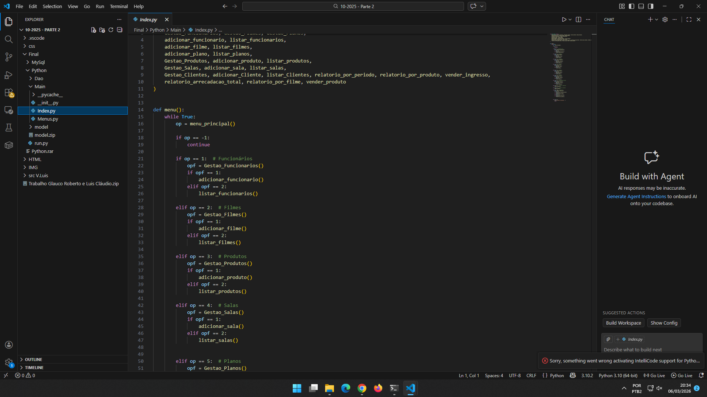

# CineManage: Sistema de Gerenciamento de Cinema

Projeto desenvolvido para a disciplina de **Algoritmos e Estrutura de Dados II**. 
O sistema é uma solução de back-end desenvolvida em **Python** para gerenciar as operações de um cinema, 
integrando lógica de programação com persistência de dados em **MySQL**.

---

## Visual do Projeto

### Estrutura do Código e Interface

---

### Colaboradores
* **Glauco Berbert**
* **Luiz Salvato**

### Funcionalidades Principais
* **Estoque (Bomboniere):** Gerenciamento de itens da lanchonete (pipocas, refrigerantes, etc).
* **Salas e Filmes:** Cadastro de sessões, horários e organização de ocupação.
* **Vendas:** Lógica para controle de ingressos e integração com banco de dados.

### Tecnologias e Conceitos de AED II
* **Linguagem:** Python 3.
* **Banco de Dados:** MySQL (Persistência de dados real).
* **Conceitos Aplicados:** * **Manipulação de SQL:** Consultas, inserções e atualizações via código.
    * **Dicionários e Listas:** Para organização temporária dos dados em memória.
    * **Modularização:** Divisão do sistema em funções e scripts específicos.

### Como executar (Requisitos)
1. Possuir o **Python** instalado.
2. Ter um servidor **MySQL** ativo.
3. Configurar as credenciais de acesso no script de conexão.
4. Instalar as dependências: `pip install mysql-connector-python`.
